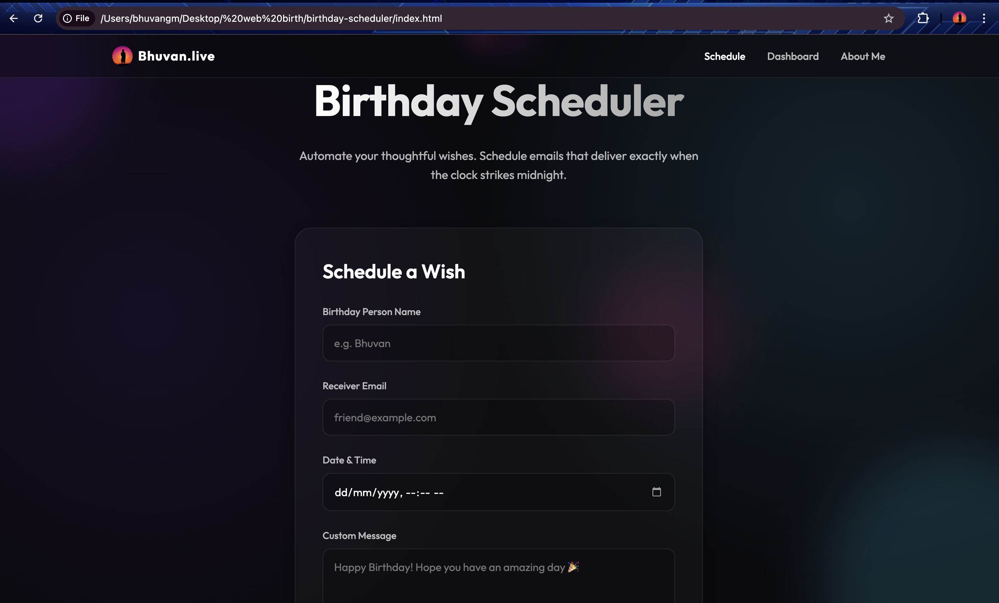
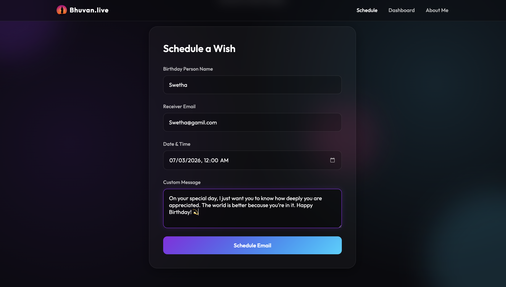
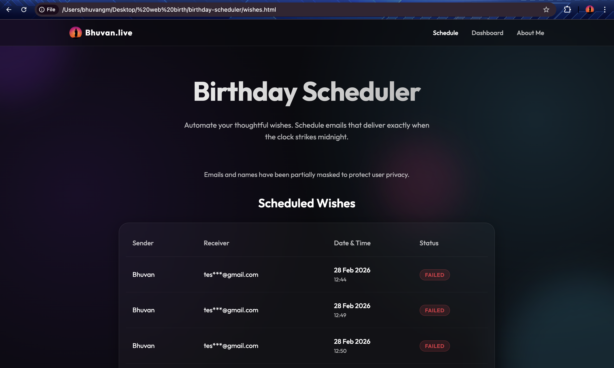
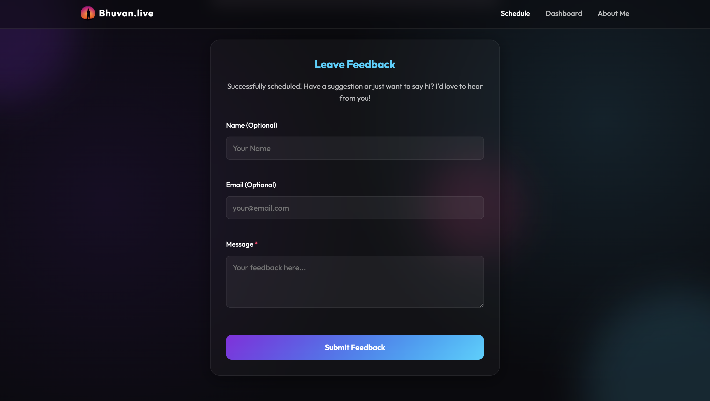

# Bhuvan.live Birthday Scheduler 🎉

An exquisite, automated web tool designed to ensure you never miss a loved one's special day again. Schedule a personalized, heartfelt email today, and let the system automatically deliver it precisely when the clock strikes midnight tomorrow!

*(Please place a screenshot of your main landing page here, saved as `screenshots/home.png`)*

## 💡 Why is this Useful?
We all have busy lives, and despite our best intentions, forgetting to send a birthday text right at midnight happens. This platform is built to take that stress away. 
- **Automated Delivery:** Schedule your wish days or weeks in advance. The server handles the delivery exactly at your selected date and time.
- **Privacy First:** Scheduled wishes are viewable on the dashboard, but email addresses are completely masked (e.g. `bhu***@example.com`) to protect user data.
- **Fail-Safe Mechanism:** Internet hiccups happen. If an email fails to deliver, the system's persistent cron engine will automatically retry 3 times to guarantee your surprise makes it through.

---

## 📸 Screenshots & Workflow

### 1. The Schedule Form
The core of the platform. A simple, beautiful glassmorphism interface where users enter their name, the recipient's email, the precise local delivery date/time, and their custom message.

*(Please place a screenshot of the form here, saved as `screenshots/schedule.png`)*

### 2. The Dashboard
Complete transparency. Users can view all pending, sent, and failed wishes in a secure, privacy-focused dashboard.

*(Please place a screenshot of the dashboard here, saved as `screenshots/dashboard.png`)*

### 3. Feedback Engine
Immediately upon scheduling a wish, a direct feedback pipeline opens, allowing users to send suggestions straight to the developer's secure MongoDB cluster.

*(Please place a screenshot of the feedback form here, saved as `screenshots/feedback.png`)*

---

## 🛠️ How it Works (Under the Hood)

This platform is a Full-Stack application utilizing a powerful, asynchronous cron engine.

1. **Frontend Request:** The user submits the HTML5 form. Vanilla JavaScript validates the data, converts their local timezone into universal UTC time, and fires a POST request to the Express backend.
2. **Backend Validation:** The Node.js Express server receives the request, passes it through a strict API Rate Limiter (to prevent spam), and validates the payload formatting.
3. **Database Storage:** The valid payload is safely stored in a **MongoDB Atlas** database using Mongoose schemas.
4. **The Cron Engine (`node-cron`):** Every 60 seconds, a relentless background loop queries the MongoDB database looking for `Pending` wishes whose scheduled UTC time is ≤ the current server time.
5. **SMTP Delivery:** When a match is found, the server passes the data to `Nodemailer`, which securely connects to an SMTP service and hands off the generated email for delivery.
6. **State Management:** Upon success, the database record updates to `Sent`. If it fails, the system increments a retry counter and attempts redelivery again in exactly one minute.

## 🚀 Tech Stack

- **Frontend:** HTML5, CSS3 (Glassmorphism aesthetics), Vanilla JavaScript
- **Backend:** Node.js, Express.js
- **Database:** MongoDB (via Mongoose)
- **Utilities:** `nodemailer` for email, `node-cron` for scheduling automation, `express-rate-limit` for API security.

---

## 👤 About the Creator
Created with ❤️ by Bhuvan. As a software engineer, I love building automated tools that bring joy to people's lives through seamless digital experiences.

🌐 [Portfolio](https://bhuvan.live) | 💻 [GitHub](https://github.com/bhuvanexpo) | 📇 [LinkedIn](https://linkedin.com/in/bhuvanexpo)
